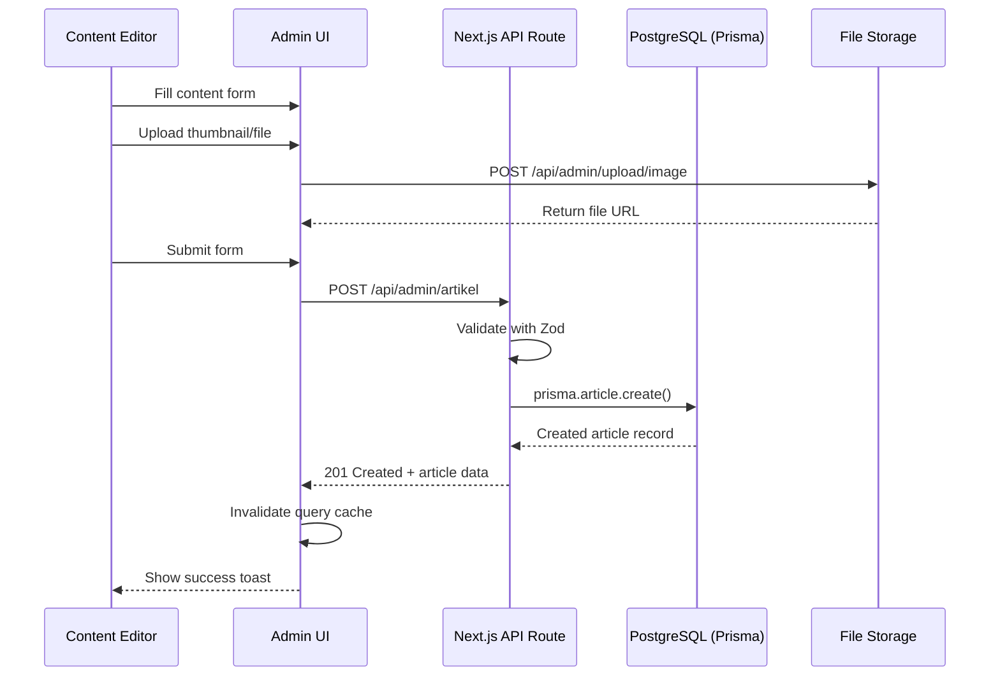
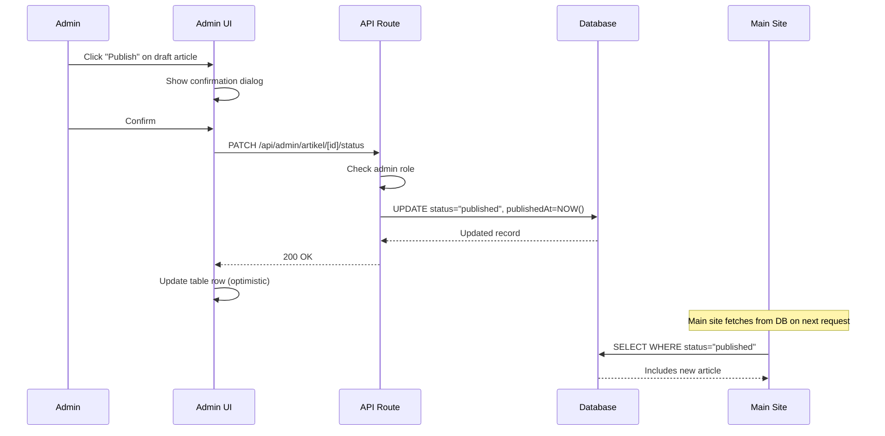
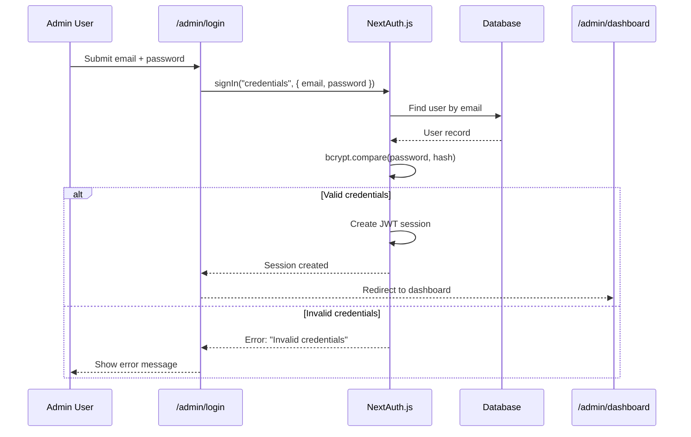

# Software Design Document (SDD)
# Admin Panel — Markaz Ilmu

**Version:** 1.0.0
**Date:** 2026-02-26
**Status:** Draft
**Project:** Markaz Ilmu — Islamic Knowledge Platform
**Prepared by:** Claude Code (AI-assisted design)

---

## Table of Contents

1. [Introduction](#1-introduction)
2. [System Overview](#2-system-overview)
3. [Feature Inventory from Main App](#3-feature-inventory-from-main-app)
4. [Admin Panel Feature Specifications](#4-admin-panel-feature-specifications)
5. [Admin Panel Modules](#5-admin-panel-modules)
6. [Role-Based Access Control (RBAC)](#6-role-based-access-control-rbac)
7. [Component Architecture](#7-component-architecture)
8. [Data Flow & State Management](#8-data-flow--state-management)
9. [Routing & Navigation](#9-routing--navigation)
10. [API Design for Admin Panel](#10-api-design-for-admin-panel)
11. [UI/UX Guidelines](#11-uiux-guidelines)
12. [Security Considerations](#12-security-considerations)
13. [Non-Functional Requirements](#13-non-functional-requirements)
14. [Implementation Roadmap](#14-implementation-roadmap)
15. [Appendix](#15-appendix)

---

## 1. Introduction

### 1.1 Purpose & Scope of the Admin Panel

This document describes the design of the **Markaz Ilmu Admin Panel**, a dedicated management interface for administrators and content moderators of the Markaz Ilmu platform. The admin panel provides full CRUD capabilities over all content types that currently exist as hardcoded static data in `src/data/dummy.ts`, replacing that data layer with a dynamic, database-backed system managed through this interface.

**In scope:**
- Full content lifecycle management for all 9 feature modules (Artikel, Video Kajian, Audio Kajian, E-Book, Do'a & Dzikir, Jadwal Kajian, Jadwal Sholat Configuration, Tanya Jawab, Donasi)
- User and role management
- Donation campaign monitoring
- Q&A moderation and response management
- Site-wide configuration (bank accounts, social links, featured content)
- Audit logging and activity monitoring
- Analytics and reporting dashboard

**Out of scope (Phase 1):**
- Payment gateway integration
- Email marketing automation
- Mobile admin app
- Multi-language CMS (admin UI will be in Indonesian)

### 1.2 Intended Audience

| Audience | Role |
|---|---|
| **Super Admin** | Full access, manages all content and users |
| **Admin** | Manages content, cannot manage admin users |
| **Moderator** | Reviews and approves Q&A submissions |
| **Content Editor** | Creates and edits content, cannot publish |
| **Viewer** | Read-only dashboard and analytics access |
| **Frontend Developers** | This document guides API and data model implementation |
| **Stakeholders** | Review feature scope and access hierarchy |

### 1.3 Relationship to the Main Application

The main application (`markaz-ilmu`) currently serves content from hardcoded arrays in `src/data/dummy.ts`. The admin panel is the **management layer** that will replace this static data with dynamic database-backed content. The relationship is:

```
Admin Panel ──writes──► Database ──reads──► Main App (markaz-ilmu)
```

The admin panel does **not** replace or modify the main application's UI. It operates as a separate Next.js application (or embedded module at `/admin` route) that the main app consumes via internal API routes.

---

## 2. System Overview

### 2.1 Admin Panel Description & Goals

The Markaz Ilmu Admin Panel is a server-rendered, role-protected web application that gives authorized personnel the ability to:

1. **Manage all content** — create, publish, update, and archive articles, videos, audios, ebooks, duas, study schedules, Q&A items
2. **Monitor donations** — view campaign progress and payment confirmation logs
3. **Moderate submissions** — review questions from the public Q&A form
4. **Configure the platform** — update bank account details, WhatsApp links, featured content, site metadata
5. **Audit actions** — track every create/update/delete performed by any admin user
6. **Analyze usage** — view content views, user engagement metrics, prayer time API usage

### 2.2 Tech Stack Recommendation

The admin panel must be consistent with the existing main application stack to minimize context switching for developers.

| Layer | Technology | Rationale |
|---|---|---|
| **Framework** | Next.js 16.1.6 (App Router) | Same as main app; shared conventions |
| **Language** | TypeScript 5 | Same as main app |
| **Styling** | Tailwind CSS v4 + shadcn/ui | Same component system as main app |
| **UI Components** | Radix UI primitives | Already a dependency in main app |
| **Animation** | Framer Motion | Already a dependency in main app |
| **Icons** | Lucide React | Already a dependency in main app |
| **Database ORM** | Prisma | Type-safe, excellent Next.js integration |
| **Database** | PostgreSQL (via Supabase or Railway) | Scalable, free tier available |
| **Authentication** | NextAuth.js v5 (Auth.js) | Native Next.js auth, supports credentials + OAuth |
| **File Storage** | Supabase Storage or Cloudflare R2 | PDF ebooks, poster images, thumbnails |
| **Form Handling** | React Hook Form + Zod | Type-safe form validation |
| **Data Fetching** | TanStack Query (React Query) | Server state, caching, invalidation |
| **Rich Text Editor** | Tiptap (or Plate.js) | For article content (replaces HTML strings) |
| **Charts** | Recharts | Lightweight, composable, Tailwind-friendly |
| **Tables** | TanStack Table | Feature-rich with sorting, filtering, pagination |
| **Date Handling** | date-fns | Already effectively used (date strings) |

### 2.3 High-Level Architecture

The admin panel will be implemented as an **embedded module** within the existing Next.js application under the `/admin` route prefix. This avoids maintaining a separate deployment while keeping the admin UI isolated from the public-facing pages.

```
markaz-ilmu/
├── src/
│   ├── app/
│   │   ├── (main)/           ← Public-facing pages (existing)
│   │   │   ├── page.tsx
│   │   │   ├── artikel/
│   │   │   └── ...
│   │   ├── admin/            ← NEW: Admin Panel Module
│   │   │   ├── layout.tsx    ← Admin layout (sidebar + topbar)
│   │   │   ├── page.tsx      ← Redirect to /admin/dashboard
│   │   │   ├── dashboard/
│   │   │   ├── artikel/
│   │   │   ├── video-kajian/
│   │   │   ├── audio-kajian/
│   │   │   ├── ebook/
│   │   │   ├── doa-dzikir/
│   │   │   ├── jadwal-kajian/
│   │   │   ├── tanya-jawab/
│   │   │   ├── donasi/
│   │   │   ├── pengaturan/
│   │   │   ├── pengguna/
│   │   │   └── audit-log/
│   │   └── api/              ← NEW: Internal API routes
│   │       ├── auth/
│   │       ├── artikel/
│   │       ├── video-kajian/
│   │       └── ...
│   ├── components/
│   │   ├── admin/            ← NEW: Admin-specific components
│   │   └── (existing components)
│   └── lib/
│       ├── prisma.ts         ← NEW: Prisma client
│       ├── auth.ts           ← NEW: NextAuth config
│       └── utils.ts          ← Existing
```

### 2.4 Integration Points with the Main Application

| Integration Point | Current State | Admin Panel Integration |
|---|---|---|
| **Article Data** | `KONTEN_TERBARU` array in `dummy.ts` | Replace with `prisma.article.findMany()` API call |
| **E-Book Data** | `EBOOKS` array in `dummy.ts` | Replace with `prisma.ebook.findMany()` API call |
| **Event Data** | `EVENT_KAJIAN` array in `dummy.ts` | Replace with `prisma.event.findMany()` API call |
| **Doa Data** | `LIST_DOA_DZIKIR` array in `dummy.ts` | Replace with `prisma.doa.findMany()` API call |
| **Video Data** | `VIDEOS_KAJIAN` array in `dummy.ts` | Replace with `prisma.video.findMany()` API call |
| **Audio Data** | `AUDIOS_SPOTIFY` array in `dummy.ts` | Replace with `prisma.audio.findMany()` API call |
| **Q&A Data** | `QA_DATA` array in `dummy.ts` | Replace with `prisma.qa.findMany()` API call |
| **Donation Info** | Hardcoded BSI account in `DonationClientPage.tsx` | Replace with `prisma.donationConfig.findFirst()` |
| **Prayer Times** | Aladhan external API (no local data) | No change needed for basic; admin configures default city |

---

## 3. Feature Inventory from Main App

The following table maps every existing feature in the main application to its corresponding admin management capability.

| # | Main App Feature | Source File | Data Model | Admin Capability |
|---|---|---|---|---|
| 1 | **Article Listing & Detail** | `src/app/artikel/` | `KONTEN_TERBARU` | Artikel Management (CRUD + publish/unpublish) |
| 2 | **Article Categories** | `dummy.ts` (hardcoded strings) | Implicit enum | Category Configuration |
| 3 | **Trending Badge** | `isTrending: boolean` in article | `KONTEN_TERBARU` | Toggle trending flag per article |
| 4 | **Video Kajian** | `src/app/video-kajian/` | `VIDEOS_KAJIAN` | Video Management (CRUD + YouTube ID) |
| 5 | **Audio Kajian** | `src/app/audio-kajian/` | `AUDIOS_SPOTIFY` | Audio Management (CRUD + Spotify ID) |
| 6 | **E-Book Library** | `src/app/ebook/` | `EBOOKS` | E-Book Management (CRUD + file upload) |
| 7 | **Do'a & Dzikir** | `src/app/doa-dzikir/` | `LIST_DOA_DZIKIR` | Doa/Dzikir Management (CRUD + Arabic/Latin/Translation) |
| 8 | **Study Schedule** | `src/app/jadwal-kajian/` | `EVENT_KAJIAN` | Event Management (CRUD + poster upload) |
| 9 | **Prayer Times** | `src/app/jadwal-sholat/` | External API (Aladhan) | Default City & Fallback Config |
| 10 | **Q&A Public Form** | `src/app/tanya-jawab/` | `QA_DATA` | Q&A Moderation (review, answer, publish) |
| 11 | **Donation Info** | `src/app/donasi/` | Hardcoded BSI details | Donation Config & Campaign Management |
| 12 | **Newsletter Signup** | `newsletter-card.tsx` | No backend | Newsletter Subscriber Management |
| 13 | **Homepage Hero** | `src/app/_components/HomeClientPage.tsx` | First article in array | Featured Content Control |
| 14 | **Ramadan Widget** | `ramadan-floating-widget.tsx` | Hardcoded Ramadan date | Ramadan Widget Configuration |
| 15 | **Site Navigation** | `KATEGORI_BELAJAR`, `PROGRAM_KAMI` | `dummy.ts` | Navigation Menu Management |
| 16 | **Social Sharing** | Per-article share buttons | Page URL | No admin needed (auto-derived) |
| 17 | **Font Size Control** | `font-size-provider.tsx` | localStorage | No admin needed (user preference) |
| 18 | **Dark Mode** | `theme-provider.tsx` | localStorage | No admin needed (user preference) |

---

## 4. Admin Panel Feature Specifications

### 4.1 Artikel (Article) Management

**Purpose:** Full lifecycle management of Islamic articles displayed across the platform.

**Admin Interaction Flow:**
```
Admin visits /admin/artikel
  → Views paginated table of all articles
  → Clicks "Tambah Artikel" → Form opens
  → Fills: title, category, content (rich text), thumbnail, author, summary
  → Submits → Article saved as "Draft"
  → Clicks "Publish" → Article status changes to "Published"
  → Published articles appear on main site immediately
```

**CRUD Operations:**

| Operation | Description |
|---|---|
| **Create** | New article with full rich text content, thumbnail upload, SEO metadata |
| **Read** | Paginated table with sort/filter by category, status, date, author |
| **Update** | Edit any field, re-upload thumbnail, change status |
| **Delete** | Soft delete (archive) or hard delete with confirmation dialog |

**Components to Build:**
- `ArticleTable` — sortable, filterable data table with bulk actions
- `ArticleForm` — multi-section form with rich text editor (Tiptap)
- `ArticleStatusBadge` — Draft / Published / Archived badge
- `ArticleThumbnailUpload` — drag-and-drop image upload with preview
- `ArticlePreviewModal` — renders article as it appears on main site

**State & Data Management:**
- TanStack Query: `useArticles()`, `useArticle(id)`, `useCreateArticle()`, `useUpdateArticle()`, `useDeleteArticle()`
- Optimistic updates for status toggles
- Form state: React Hook Form + Zod schema validation

**Zod Schema:**
```typescript
const ArticleSchema = z.object({
  title: z.string().min(5).max(200),
  slug: z.string().regex(/^[a-z0-9-]+$/).min(3),
  category: z.enum(["Akidah", "Manhaj", "Fikih", "Akhlak", "Do'a & Dzikir"]),
  content: z.string().min(100),
  summary: z.string().min(20).max(500),
  thumbnail: z.string().url(),
  author: z.string().min(2).max(100),
  isTrending: z.boolean().default(false),
  status: z.enum(["draft", "published", "archived"]).default("draft"),
  publishedAt: z.date().optional(),
});
```

**API Endpoints:**

| Method | Endpoint | Description |
|---|---|---|
| GET | `/api/admin/artikel` | List with pagination, filter, sort |
| POST | `/api/admin/artikel` | Create new article |
| GET | `/api/admin/artikel/[id]` | Get single article |
| PUT | `/api/admin/artikel/[id]` | Full update |
| PATCH | `/api/admin/artikel/[id]/status` | Toggle status only |
| DELETE | `/api/admin/artikel/[id]` | Soft delete |

**Permissions:**
- Create/Edit: Admin, Content Editor
- Publish: Admin only
- Delete: Admin only
- View: All admin roles

**Edge Cases & Validations:**
- Slug must be unique; auto-generate from title with collision check
- Thumbnail URL must be a valid URL (Unsplash, Supabase Storage, or external)
- Rich text content sanitized with DOMPurify before storage
- Prevent deletion of articles that are "featured" on homepage
- Warn before archiving trending articles

---

### 4.2 Video Kajian Management

**Purpose:** Manage YouTube video entries displayed on the platform.

**Admin Interaction Flow:**
```
Admin visits /admin/video-kajian
  → Views video cards with thumbnails
  → Clicks "Tambah Video" → Form with YouTube ID field
  → Enters YouTube video ID → thumbnail auto-fetched from YouTube
  → Fills: title, speaker, category, duration
  → Submits → Video appears on main site
```

**CRUD Operations:**

| Operation | Description |
|---|---|
| **Create** | Add YouTube video by ID with metadata |
| **Read** | Card/table view with YouTube thumbnail previews |
| **Update** | Edit title, speaker, category, featured status |
| **Delete** | Remove video from listing |

**Components to Build:**
- `VideoTable` — table with embedded YouTube thumbnail
- `VideoForm` — form with YouTube ID input and metadata fields
- `YouTubeIdPreview` — live preview of YouTube embed from entered ID
- `FeaturedVideoSelector` — select which video is featured on homepage

**Zod Schema:**
```typescript
const VideoSchema = z.object({
  title: z.string().min(5).max(200),
  speaker: z.string().min(2).max(100),
  duration: z.string().regex(/^\d{1,2}:\d{2}:\d{2}$/), // HH:MM:SS
  category: z.enum(["Akidah", "Fikih", "Akhlak", "Tafsir", "Muamalah"]),
  youtubeId: z.string().min(11).max(11),
  isFeatured: z.boolean().default(false),
  status: z.enum(["draft", "published", "archived"]),
});
```

**API Endpoints:**

| Method | Endpoint | Description |
|---|---|---|
| GET | `/api/admin/video-kajian` | List all videos |
| POST | `/api/admin/video-kajian` | Add new video |
| PUT | `/api/admin/video-kajian/[id]` | Update video |
| DELETE | `/api/admin/video-kajian/[id]` | Remove video |
| GET | `/api/admin/video-kajian/validate-youtube/[youtubeId]` | Validate YouTube ID |

**Permissions:** Admin, Content Editor (create/edit); Admin only (delete)

**Edge Cases & Validations:**
- YouTube ID format: exactly 11 alphanumeric characters
- Validate YouTube ID is accessible before saving (call oEmbed API)
- Only one video can be `isFeatured = true` at a time (auto-deselect previous)

---

### 4.3 Audio Kajian Management

**Purpose:** Manage Spotify audio entries (playlists, shows, episodes) on the platform.

**Admin Interaction Flow:**
```
Admin visits /admin/audio-kajian
  → Views audio grid with Spotify artwork
  → Clicks "Tambah Audio"
  → Selects type: playlist | show | episode
  → Enters Spotify ID → cover image auto-fetched
  → Fills metadata and submits
```

**CRUD Operations:**

| Operation | Description |
|---|---|
| **Create** | Add Spotify content by type and ID |
| **Read** | Grid view with Spotify artwork |
| **Update** | Edit metadata, change featured status |
| **Delete** | Remove from listing |

**Zod Schema:**
```typescript
const AudioSchema = z.object({
  title: z.string().min(3).max(200),
  speaker: z.string().min(2).max(100),
  category: z.string().min(2).max(50),
  image: z.string().url(),
  type: z.enum(["playlist", "show", "episode"]),
  spotifyId: z.string().min(10).max(30),
  isFeatured: z.boolean().default(false),
  status: z.enum(["draft", "published", "archived"]),
});
```

**API Endpoints:**

| Method | Endpoint | Description |
|---|---|---|
| GET | `/api/admin/audio-kajian` | List all audios |
| POST | `/api/admin/audio-kajian` | Add new audio |
| PUT | `/api/admin/audio-kajian/[id]` | Update audio |
| DELETE | `/api/admin/audio-kajian/[id]` | Remove audio |

**Edge Cases & Validations:**
- Spotify ID format varies by type; validate against Spotify oEmbed endpoint
- Cover image URL should be stored locally (download from Spotify) to avoid broken embeds

---

### 4.4 E-Book Management

**Purpose:** Manage e-book library entries including PDF file hosting.

**Admin Interaction Flow:**
```
Admin visits /admin/ebook
  → Views book grid with covers
  → Clicks "Upload Ebook"
  → Uploads PDF file → auto-extract file size
  → Uploads cover image
  → Fills: title, author, category
  → Submits → Book appears in library
```

**CRUD Operations:**

| Operation | Description |
|---|---|
| **Create** | Upload PDF + cover image, add metadata |
| **Read** | Grid view with covers, file size, download count |
| **Update** | Replace PDF/cover, edit metadata |
| **Delete** | Remove book and associated files from storage |

**Components to Build:**
- `EbookGrid` — book jacket grid view
- `EbookUploadForm` — PDF + cover upload with progress bar
- `FileStoragePreview` — shows file size, upload date, storage path
- `DownloadCounter` — displays and tracks download count

**Zod Schema:**
```typescript
const EbookSchema = z.object({
  title: z.string().min(3).max(200),
  author: z.string().min(2).max(100),
  thumbnail: z.string().url(),
  fileUrl: z.string().url(),
  fileSize: z.string(), // e.g., "2.4 MB"
  category: z.enum(["Akidah", "Fikih", "Akhlak", "Hadits", "Tafsir"]),
  status: z.enum(["draft", "published", "archived"]),
  isReadOnline: z.boolean().default(true),
  isDownloadable: z.boolean().default(true),
});
```

**API Endpoints:**

| Method | Endpoint | Description |
|---|---|---|
| GET | `/api/admin/ebook` | List all ebooks |
| POST | `/api/admin/ebook` | Create ebook entry |
| PUT | `/api/admin/ebook/[id]` | Update ebook |
| DELETE | `/api/admin/ebook/[id]` | Delete ebook + files |
| POST | `/api/admin/upload/ebook-pdf` | Upload PDF to storage |
| POST | `/api/admin/upload/ebook-cover` | Upload cover image |

**Permissions:** Admin, Content Editor (upload/edit); Admin only (delete)

**Edge Cases & Validations:**
- PDF max size: 50 MB
- Cover image: JPEG/PNG, max 5 MB, auto-resize to standard dimensions
- File size auto-calculated from uploaded file, stored as human-readable string
- Deletion must remove both database record AND storage files atomically

---

### 4.5 Do'a & Dzikir Management

**Purpose:** Manage the Islamic prayers and remembrances database with Arabic text support.

**Admin Interaction Flow:**
```
Admin visits /admin/doa-dzikir
  → Views paginated list of duas/adhkar
  → Clicks "Tambah Do'a"
  → Form with:
     - Title field
     - Category: Harian | Pagi | Petang
     - Arabic text (RTL textarea with Arabic font)
     - Latin transliteration
     - Indonesian translation
     - Source (HR. reference or Quran verse)
  → Submits
```

**CRUD Operations:**

| Operation | Description |
|---|---|
| **Create** | Add new doa/dzikir with all text variants |
| **Read** | Table with Arabic preview, search by title/category |
| **Update** | Edit any text field, reorder within category |
| **Delete** | Remove with confirmation |

**Components to Build:**
- `DoaTable` — table with Arabic text preview (RTL)
- `DoaForm` — multi-section form with Arabic RTL textarea
- `ArabicTextPreview` — preview Arabic text with proper Noto Naskh Arabic font
- `DoaOrderManager` — drag-and-drop reordering within category

**Zod Schema:**
```typescript
const DoaSchema = z.object({
  title: z.string().min(3).max(200),
  category: z.enum(["Harian", "Pagi", "Petang"]),
  arabic: z.string().min(5),
  latin: z.string().min(5),
  translation: z.string().min(10),
  source: z.string().min(3).max(300),
  order: z.number().int().positive().optional(),
  status: z.enum(["draft", "published", "archived"]),
});
```

**API Endpoints:**

| Method | Endpoint | Description |
|---|---|---|
| GET | `/api/admin/doa-dzikir` | List with filters |
| POST | `/api/admin/doa-dzikir` | Create new item |
| PUT | `/api/admin/doa-dzikir/[id]` | Update item |
| PATCH | `/api/admin/doa-dzikir/reorder` | Update display order |
| DELETE | `/api/admin/doa-dzikir/[id]` | Delete item |

**Edge Cases & Validations:**
- Arabic text must be right-to-left (RTL attribute set automatically)
- Arabic Unicode validation: text must contain Arabic Unicode range characters (U+0600–U+06FF)
- Source field must follow format: "HR. [Collection], No. [number]" or "QS. [Surah]:[Ayah]"
- Prevent deletion of items that have high engagement (favorite counts, if tracked)

---

### 4.6 Jadwal Kajian (Study Schedule) Management

**Purpose:** Manage study events, their posters, and scheduling information.

**Admin Interaction Flow:**
```
Admin visits /admin/jadwal-kajian
  → Views event list in chronological order
  → Clicks "Buat Event"
  → Fills: title, speaker, date, time, location
  → Toggles: Online/Offline, Free/Registration Required
  → Uploads poster image
  → Enters description
  → Submits → Event appears on schedule page
```

**CRUD Operations:**

| Operation | Description |
|---|---|
| **Create** | New event with poster upload |
| **Read** | List view with past/upcoming tabs |
| **Update** | Edit event details, replace poster |
| **Delete** | Cancel/remove event |

**Components to Build:**
- `EventList` — chronological event list with past/upcoming split
- `EventForm` — date-picker, time-picker, location input, online toggle
- `PosterUpload` — image upload with aspect ratio enforcement (poster proportions)
- `EventStatusBadge` — Upcoming / Ongoing / Completed / Cancelled

**Zod Schema:**
```typescript
const EventSchema = z.object({
  title: z.string().min(5).max(200),
  speaker: z.string().min(2).max(100),
  date: z.string().datetime(),
  time: z.string().regex(/^\d{2}:\d{2}$/), // HH:MM
  location: z.string().min(3).max(200),
  isOnline: z.boolean().default(false),
  isFree: z.boolean().default(true),
  registrationUrl: z.string().url().optional(),
  posterUrl: z.string().url(),
  description: z.string().min(10),
  status: z.enum(["upcoming", "ongoing", "completed", "cancelled"]),
});
```

**API Endpoints:**

| Method | Endpoint | Description |
|---|---|---|
| GET | `/api/admin/jadwal-kajian` | List events with date filters |
| POST | `/api/admin/jadwal-kajian` | Create new event |
| PUT | `/api/admin/jadwal-kajian/[id]` | Update event |
| PATCH | `/api/admin/jadwal-kajian/[id]/status` | Update status |
| DELETE | `/api/admin/jadwal-kajian/[id]` | Delete event |
| POST | `/api/admin/upload/poster` | Upload poster image |

**Edge Cases & Validations:**
- Date must be in the future for new events
- Online events: `registrationUrl` is required
- Poster must be uploaded before event can be published
- Completed events remain visible but are non-editable (archived state)

---

### 4.7 Tanya Jawab (Q&A) Moderation

**Purpose:** Review public question submissions, assign answerers, write answers, and publish.

**Admin Interaction Flow:**
```
Public user submits question via main site form
  ↓
Admin visits /admin/tanya-jawab
  → Sees "Antrian" (Queue) tab with unanswered questions
  → Clicks question → Detail modal opens
  → Assigns category, assigns answerer
  → Types answer in rich text
  → Clicks "Jawab & Publikasikan"
  → Q&A appears on main site

Alt flow (admin creates Q&A directly):
  Admin clicks "Buat Q&A Manual"
  → Fills question + answer + all metadata
  → Publishes immediately
```

**CRUD Operations:**

| Operation | Description |
|---|---|
| **Create** | Add Q&A manually or answer submitted question |
| **Read** | Queue + published list with status filters |
| **Update** | Edit answers, reassign category or answerer |
| **Delete** | Reject/delete inappropriate submissions |

**Components to Build:**
- `QAQueue` — incoming questions awaiting moderation
- `QAAnswerForm` — rich text answer form with answerer attribution
- `QAStatusBadge` — Pending / Answered / Published / Rejected
- `QADetailModal` — full question detail with answer drafting panel

**Zod Schema:**
```typescript
const QASchema = z.object({
  question: z.string().min(10).max(1000),
  answer: z.string().min(10),
  category: z.enum(["Akidah", "Fikih", "Akhlak", "Muamalah"]),
  askedBy: z.string().min(2).max(100).default("Anonim"),
  answeredBy: z.string().min(2).max(100).default("Lajnah Ilmiah Markaz Ilmu"),
  status: z.enum(["pending", "in_review", "answered", "published", "rejected"]),
  submittedAt: z.date(),
  publishedAt: z.date().optional(),
});
```

**API Endpoints:**

| Method | Endpoint | Description |
|---|---|---|
| GET | `/api/admin/tanya-jawab` | List Q&A with status filter |
| POST | `/api/admin/tanya-jawab` | Create Q&A manually |
| PUT | `/api/admin/tanya-jawab/[id]` | Update Q&A |
| PATCH | `/api/admin/tanya-jawab/[id]/publish` | Publish answered Q&A |
| PATCH | `/api/admin/tanya-jawab/[id]/reject` | Reject submission |
| DELETE | `/api/admin/tanya-jawab/[id]` | Delete |

**Permissions:**
- View queue: Admin, Moderator
- Answer & publish: Admin only
- Reject: Admin, Moderator

**Edge Cases & Validations:**
- Cannot publish without an answer
- Questions containing prohibited content flagged automatically (keyword list)
- Rejected questions notify submitter if email was provided
- Answerer must be an existing admin user or a preset institutional name

---

### 4.8 Donasi (Donation) Management

**Purpose:** Manage donation campaign info, bank accounts, and confirmation logs.

**Admin Interaction Flow:**
```
Admin visits /admin/donasi
  → Views: active campaign, bank account info, donation confirmations
  → Edits bank account details (bank name, account number, account name)
  → Updates WhatsApp number for donation confirmation
  → Creates/updates donation campaign (title, target, poster)
  → Views incoming WhatsApp confirmation log (manual entry)
```

**CRUD Operations:**

| Operation | Description |
|---|---|
| **Create** | New donation campaign or bank account |
| **Read** | Campaign list, bank accounts, confirmation history |
| **Update** | Edit campaign details, bank account numbers |
| **Delete** | Close/archive campaign |

**Components to Build:**
- `DonationCampaignCard` — campaign with progress bar and raised amount
- `BankAccountForm` — edit bank details with copy-test button
- `DonationConfirmationLog` — manual log of WhatsApp confirmations
- `CampaignProgress` — animated progress bar toward target amount

**Zod Schema:**
```typescript
const DonationCampaignSchema = z.object({
  title: z.string().min(5).max(200),
  description: z.string().optional(),
  targetAmount: z.number().positive().optional(),
  raisedAmount: z.number().nonnegative().default(0),
  posterUrl: z.string().url().optional(),
  status: z.enum(["active", "completed", "paused"]),
});

const BankAccountSchema = z.object({
  bankName: z.string().min(2).max(100),
  accountNumber: z.string().min(5).max(30),
  accountName: z.string().min(5).max(100),
  whatsappNumber: z.string().regex(/^\+62[0-9]{9,13}$/),
  isActive: z.boolean().default(true),
});
```

**API Endpoints:**

| Method | Endpoint | Description |
|---|---|---|
| GET | `/api/admin/donasi/campaigns` | List campaigns |
| POST | `/api/admin/donasi/campaigns` | Create campaign |
| PUT | `/api/admin/donasi/campaigns/[id]` | Update campaign |
| GET | `/api/admin/donasi/bank-accounts` | List bank accounts |
| PUT | `/api/admin/donasi/bank-accounts/[id]` | Update bank account |
| GET | `/api/admin/donasi/confirmations` | Donation confirmations log |
| POST | `/api/admin/donasi/confirmations` | Add manual confirmation |

---

### 4.9 Pengaturan (Settings) Management

**Purpose:** Configure site-wide settings that appear across multiple pages.

**Configurable Items:**
- Site title, tagline, logo
- Social media links (Facebook, YouTube, Spotify, WhatsApp, Instagram)
- Footer contact info (address, email, phone)
- Navigation menu items (`KATEGORI_BELAJAR`, `PROGRAM_KAMI`)
- Ramadan Widget enabled/disabled and Ramadan year/date
- Default prayer times city (fallback when geolocation denied)
- Featured content selections (homepage hero article, featured video, featured audio)
- SEO metadata defaults (OG title, OG description, OG image)
- Newsletter settings (enabled/disabled)

**Components to Build:**
- `SettingsForm` — tabbed settings form (General, Social, Navigation, Prayer, Featured, SEO)
- `NavigationMenuEditor` — drag-and-drop menu item management
- `FeaturedContentPicker` — content picker modal for selecting featured items
- `RamadanWidgetConfig` — date picker and toggle

---

## 5. Admin Panel Modules

### 5.1 Dashboard

**Purpose:** Central overview of all platform metrics and quick-access actions.

**Widgets / KPIs:**

| Widget | Data Source | Metric |
|---|---|---|
| Total Artikel | `prisma.article.count()` | Published articles |
| Total Views (Artikel) | Aggregate from view_log | Total article views |
| E-Books Published | `prisma.ebook.count()` | Active ebooks |
| Active Events | `prisma.event.count({ where: status: "upcoming" })` | Upcoming kajian |
| Q&A Pending | `prisma.qa.count({ where: status: "pending" })` | Needs moderation |
| Doa & Dzikir | `prisma.doa.count()` | Published items |
| Donations (Monthly) | `prisma.donationConfirmation.sum()` | Monthly confirmations |
| Videos Available | `prisma.video.count()` | Published videos |

**Charts:**
- **Content Published Over Time** — Line chart (30/60/90 day view)
- **Content by Category** — Donut chart (Akidah, Manhaj, Fikih, Akhlak, Do'a & Dzikir)
- **Q&A Queue Trend** — Bar chart (submissions per week)
- **Top Articles by Views** — Horizontal bar chart (top 5)

**Quick Actions Panel:**
- "+ Tambah Artikel"
- "+ Tambah Video"
- "+ Buat Event"
- "Lihat Antrian Q&A (n)"

**Recent Activity Feed:**
- Last 10 audit log entries with actor, action, and target

---

### 5.2 User Management (Pengguna)

**Purpose:** Manage admin panel users, their roles, and access.

**Features:**
- Create admin users with name, email, password, and role
- Assign roles: Super Admin, Admin, Moderator, Content Editor, Viewer
- Suspend/unsuspend users
- Reset passwords
- View last login and activity summary
- Two-factor authentication (2FA) enforcement toggle

**Components:**
- `UserTable` — sortable table of admin users
- `UserForm` — create/edit user with role selector
- `RoleSelector` — dropdown with role descriptions
- `ActivitySummary` — per-user recent actions count

**Zod Schema:**
```typescript
const AdminUserSchema = z.object({
  name: z.string().min(2).max(100),
  email: z.string().email(),
  password: z.string().min(8).max(100).optional(), // hashed server-side
  role: z.enum(["super_admin", "admin", "moderator", "content_editor", "viewer"]),
  isActive: z.boolean().default(true),
  requires2FA: z.boolean().default(false),
});
```

---

### 5.3 Audit Log & Activity Monitoring

**Purpose:** Complete, tamper-evident log of all admin actions.

**Tracked Events:**
- Login / logout / failed login
- Create / update / delete on any content type
- Status changes (publish, archive, reject)
- Settings changes
- User management actions

**Log Entry Schema:**
```typescript
{
  id: string (UUID)
  actorId: string (admin user ID)
  actorName: string
  action: "create" | "update" | "delete" | "publish" | "archive" | "login" | "logout"
  resource: "article" | "video" | "audio" | "ebook" | "doa" | "event" | "qa" | "user" | "settings"
  resourceId: string
  resourceTitle: string
  oldValue: JSON (for updates)
  newValue: JSON (for updates)
  ipAddress: string
  userAgent: string
  timestamp: DateTime
}
```

**UI Features:**
- Filterable by actor, action type, resource type, date range
- Expandable rows showing old/new values diff
- Export to CSV
- 90-day retention policy configurable in settings

---

### 5.4 Reports & Analytics

**Purpose:** Actionable insights on content performance and user engagement.

**Report Types:**

| Report | Description | Format |
|---|---|---|
| Content Summary | Total published per type, monthly growth | Table + Chart |
| Article Views | Top articles by view count | Table + Bar Chart |
| Q&A Activity | Submission rate, response time | Line Chart |
| Category Distribution | Content spread across Islamic categories | Pie Chart |
| Event Calendar | Upcoming/past events summary | Calendar View |
| Download Report | Ebook download counts | Table |
| Donation Summary | Monthly confirmation logs | Table + Line Chart |

**Export:** All reports exportable as CSV or PDF

---

### 5.5 Newsletter Management (Buletin)

**Purpose:** Manage email subscribers from the newsletter signup widget (`newsletter-card.tsx`).

**Features:**
- Subscriber list with email, signup date, source page
- Export subscriber list as CSV
- Unsubscribe/delete subscriber
- Basic stats: total subscribers, recent signups

*(Note: The newsletter-card.tsx currently has no backend. This module creates the backend for it.)*

---

## 6. Role-Based Access Control (RBAC)

### 6.1 Admin Roles

| Role | Description |
|---|---|
| **Super Admin** | Complete access to all modules; manages admin users and system config |
| **Admin** | All content management; cannot manage Super Admin accounts |
| **Moderator** | Reviews Q&A queue; limited content visibility |
| **Content Editor** | Creates and edits content drafts; cannot publish or delete |
| **Viewer** | Read-only access to dashboard and reports |

### 6.2 Permission Matrix

| Module / Action | Super Admin | Admin | Moderator | Content Editor | Viewer |
|---|:---:|:---:|:---:|:---:|:---:|
| **Dashboard** | ✓ | ✓ | ✓ | ✓ | ✓ |
| **Artikel — View** | ✓ | ✓ | ✗ | ✓ | ✓ |
| **Artikel — Create/Edit** | ✓ | ✓ | ✗ | ✓ | ✗ |
| **Artikel — Publish** | ✓ | ✓ | ✗ | ✗ | ✗ |
| **Artikel — Delete** | ✓ | ✓ | ✗ | ✗ | ✗ |
| **Video — View** | ✓ | ✓ | ✗ | ✓ | ✓ |
| **Video — Create/Edit** | ✓ | ✓ | ✗ | ✓ | ✗ |
| **Video — Delete** | ✓ | ✓ | ✗ | ✗ | ✗ |
| **Audio — View** | ✓ | ✓ | ✗ | ✓ | ✓ |
| **Audio — Create/Edit** | ✓ | ✓ | ✗ | ✓ | ✗ |
| **Audio — Delete** | ✓ | ✓ | ✗ | ✗ | ✗ |
| **E-Book — View** | ✓ | ✓ | ✗ | ✓ | ✓ |
| **E-Book — Upload/Edit** | ✓ | ✓ | ✗ | ✓ | ✗ |
| **E-Book — Delete** | ✓ | ✓ | ✗ | ✗ | ✗ |
| **Do'a & Dzikir — View** | ✓ | ✓ | ✗ | ✓ | ✓ |
| **Do'a & Dzikir — Create/Edit** | ✓ | ✓ | ✗ | ✓ | ✗ |
| **Do'a & Dzikir — Delete** | ✓ | ✓ | ✗ | ✗ | ✗ |
| **Jadwal Kajian — View** | ✓ | ✓ | ✗ | ✓ | ✓ |
| **Jadwal Kajian — Create/Edit** | ✓ | ✓ | ✗ | ✓ | ✗ |
| **Jadwal Kajian — Delete** | ✓ | ✓ | ✗ | ✗ | ✗ |
| **Tanya Jawab — View Queue** | ✓ | ✓ | ✓ | ✗ | ✗ |
| **Tanya Jawab — Answer/Publish** | ✓ | ✓ | ✗ | ✗ | ✗ |
| **Tanya Jawab — Reject** | ✓ | ✓ | ✓ | ✗ | ✗ |
| **Donasi — View** | ✓ | ✓ | ✗ | ✗ | ✓ |
| **Donasi — Edit Config** | ✓ | ✓ | ✗ | ✗ | ✗ |
| **Newsletter — View** | ✓ | ✓ | ✗ | ✗ | ✓ |
| **Newsletter — Export** | ✓ | ✓ | ✗ | ✗ | ✗ |
| **Pengaturan (Settings)** | ✓ | ✓ | ✗ | ✗ | ✗ |
| **Pengguna (User Mgmt)** | ✓ | ✗ | ✗ | ✗ | ✗ |
| **Audit Log** | ✓ | ✓ | ✗ | ✗ | ✗ |
| **Reports** | ✓ | ✓ | ✗ | ✗ | ✓ |

---

## 7. Component Architecture

### 7.1 Admin Panel Component Hierarchy

```
src/app/admin/layout.tsx  ← AdminLayout
├── AdminSidebar
│   ├── AdminLogo
│   ├── AdminNavItem (× N)
│   │   └── AdminNavSubItem (× N)
│   └── AdminUserCard (current user)
├── AdminTopbar
│   ├── AdminBreadcrumb
│   ├── AdminSearchBar
│   ├── AdminNotificationBell
│   └── AdminUserMenu
└── AdminContent (slot for page content)
    └── [page-specific components]
```

### 7.2 Shared/Reusable Admin Components

```
src/components/admin/
├── layout/
│   ├── AdminLayout.tsx
│   ├── AdminSidebar.tsx
│   ├── AdminTopbar.tsx
│   ├── AdminBreadcrumb.tsx
│   └── AdminNavItem.tsx
├── data-display/
│   ├── DataTable.tsx          ← TanStack Table wrapper with sort/filter/pagination
│   ├── DataTablePagination.tsx
│   ├── DataTableToolbar.tsx   ← Search + filter bar above table
│   ├── StatsCard.tsx          ← KPI card for dashboard
│   ├── EmptyState.tsx         ← Empty list state with CTA
│   └── ContentStatusBadge.tsx ← Draft/Published/Archived badge
├── forms/
│   ├── RichTextEditor.tsx     ← Tiptap wrapper
│   ├── ImageUpload.tsx        ← Drag-drop image upload with preview
│   ├── FileUpload.tsx         ← PDF/generic file upload
│   ├── ArabicTextarea.tsx     ← RTL textarea for Arabic content
│   ├── DateTimePicker.tsx     ← Date + time selection
│   ├── CategorySelect.tsx     ← Reusable category dropdown
│   └── FormSection.tsx        ← Form section with title and description
├── feedback/
│   ├── ConfirmDialog.tsx      ← Confirmation modal for destructive actions
│   ├── ActionToast.tsx        ← Success/error toast notifications
│   ├── LoadingOverlay.tsx     ← Full-page loading state
│   └── ErrorBoundary.tsx      ← Error boundary wrapper
└── charts/
    ├── ContentLineChart.tsx
    ├── CategoryDonutChart.tsx
    └── TopItemsBarChart.tsx
```

### 7.3 Layout Structure

```
┌─────────────────────────────────────────────────────────┐
│  AdminTopbar: [Breadcrumb] ───────── [Search] [🔔] [👤] │
├──────────────┬──────────────────────────────────────────┤
│              │                                           │
│  AdminSidebar│  Main Content Area                       │
│  ─────────── │  ─────────────────────────────────────── │
│  📊 Dashboard│  [Page Title]        [Action Buttons]    │
│  📄 Artikel  │                                           │
│  🎬 Video    │  [Content: Table / Form / Cards / Chart]  │
│  🎵 Audio    │                                           │
│  📚 E-Book   │                                           │
│  🤲 Do'a    │                                           │
│  🗓 Jadwal  │                                           │
│  ❓ Q&A      │                                           │
│  💰 Donasi   │                                           │
│  ─────────── │                                           │
│  ⚙ Pengatur │                                           │
│  👥 Pengguna │                                           │
│  📋 Log      │                                           │
│  📊 Laporan  │                                           │
└──────────────┴──────────────────────────────────────────┘
```

---

## 8. Data Flow & State Management

### 8.1 Global Admin State Structure

```typescript
// Admin App State (Zustand or Context)
interface AdminState {
  // Authentication
  currentUser: AdminUser | null;
  isAuthenticated: boolean;

  // UI State
  sidebarCollapsed: boolean;
  theme: "light" | "dark";

  // Notification
  unreadNotifications: number;
  qaQueueCount: number;
}
```

Server state (content data) is managed entirely by **TanStack Query** — no need to store it in global state.

### 8.2 Data Fetching Strategy

```typescript
// Example: Article list with pagination
const useArticles = (params: ArticleQueryParams) => {
  return useQuery({
    queryKey: ["admin", "articles", params],
    queryFn: () => fetchArticles(params),
    staleTime: 1000 * 60 * 2, // 2 minutes
  });
};

// Optimistic update on status change
const useToggleArticleStatus = () => {
  const queryClient = useQueryClient();
  return useMutation({
    mutationFn: ({ id, status }) => updateArticleStatus(id, status),
    onMutate: async ({ id, status }) => {
      await queryClient.cancelQueries({ queryKey: ["admin", "articles"] });
      const previous = queryClient.getQueryData(["admin", "articles"]);
      queryClient.setQueryData(["admin", "articles"], (old) =>
        old.map(a => a.id === id ? { ...a, status } : a)
      );
      return { previous };
    },
    onError: (err, _, context) => {
      queryClient.setQueryData(["admin", "articles"], context?.previous);
    },
    onSettled: () => {
      queryClient.invalidateQueries({ queryKey: ["admin", "articles"] });
    },
  });
};
```

### 8.3 Key Data Flow Diagrams

**Content Creation Flow:**



**Content Publication Flow:**



**Authentication Flow:**



---

## 9. Routing & Navigation

### 9.1 Full Admin Route Map

```
/admin
├── /admin/login                        ← Public: Login page
├── /admin/                             ← Redirect to /admin/dashboard
├── /admin/dashboard                    ← All roles
├── /admin/artikel
│   ├── /admin/artikel                  ← List view
│   ├── /admin/artikel/baru             ← Create form
│   └── /admin/artikel/[id]/edit        ← Edit form
├── /admin/video-kajian
│   ├── /admin/video-kajian             ← List view
│   ├── /admin/video-kajian/baru        ← Create form
│   └── /admin/video-kajian/[id]/edit   ← Edit form
├── /admin/audio-kajian
│   ├── /admin/audio-kajian             ← List view
│   ├── /admin/audio-kajian/baru        ← Create form
│   └── /admin/audio-kajian/[id]/edit   ← Edit form
├── /admin/ebook
│   ├── /admin/ebook                    ← Library grid view
│   ├── /admin/ebook/upload             ← Upload form
│   └── /admin/ebook/[id]/edit          ← Edit metadata
├── /admin/doa-dzikir
│   ├── /admin/doa-dzikir               ← List view with category tabs
│   ├── /admin/doa-dzikir/baru          ← Create form
│   └── /admin/doa-dzikir/[id]/edit     ← Edit form
├── /admin/jadwal-kajian
│   ├── /admin/jadwal-kajian            ← Calendar/list view
│   ├── /admin/jadwal-kajian/baru       ← Create form
│   └── /admin/jadwal-kajian/[id]/edit  ← Edit form
├── /admin/tanya-jawab
│   ├── /admin/tanya-jawab              ← Queue + published list
│   ├── /admin/tanya-jawab/baru         ← Manual Q&A creation
│   └── /admin/tanya-jawab/[id]         ← Answer/moderate detail
├── /admin/donasi
│   ├── /admin/donasi                   ← Campaign dashboard
│   ├── /admin/donasi/kampanye/[id]     ← Campaign detail
│   └── /admin/donasi/pengaturan        ← Bank account config
├── /admin/pengguna                     ← Super Admin only
│   ├── /admin/pengguna                 ← User list
│   ├── /admin/pengguna/baru            ← Create user
│   └── /admin/pengguna/[id]/edit       ← Edit user
├── /admin/pengaturan                   ← Admin+
│   ├── /admin/pengaturan/umum          ← General site settings
│   ├── /admin/pengaturan/navigasi      ← Navigation menu editor
│   ├── /admin/pengaturan/konten-unggulan ← Featured content
│   └── /admin/pengaturan/ramadan       ← Ramadan widget config
├── /admin/audit-log                    ← Admin+
└── /admin/laporan                      ← Viewer+
    ├── /admin/laporan/konten
    ├── /admin/laporan/artikel-views
    └── /admin/laporan/donasi
```

### 9.2 Protected Routes with Role-Based Guards

All `/admin/*` routes (except `/admin/login`) are protected by a middleware:

```typescript
// src/middleware.ts
import { auth } from "@/lib/auth";
import { NextResponse } from "next/server";

export default auth((req) => {
  const { pathname } = req.nextUrl;

  // Allow login page
  if (pathname === "/admin/login") return NextResponse.next();

  // Require authentication for all admin routes
  if (!req.auth) {
    return NextResponse.redirect(new URL("/admin/login", req.url));
  }

  const role = req.auth.user.role;

  // Super Admin only routes
  if (pathname.startsWith("/admin/pengguna") && role !== "super_admin") {
    return NextResponse.redirect(new URL("/admin/dashboard", req.url));
  }

  return NextResponse.next();
});

export const config = {
  matcher: ["/admin/:path*"],
};
```

### 9.3 Breadcrumb Structure

| Route | Breadcrumb |
|---|---|
| `/admin/dashboard` | Dashboard |
| `/admin/artikel` | Konten › Artikel |
| `/admin/artikel/baru` | Konten › Artikel › Tambah Baru |
| `/admin/artikel/123/edit` | Konten › Artikel › Edit: [Title] |
| `/admin/tanya-jawab` | Moderasi › Tanya Jawab |
| `/admin/pengaturan/navigasi` | Pengaturan › Navigasi |

---

## 10. API Design for Admin Panel

### 10.1 Authentication Mechanism

All admin API routes require a valid JWT session cookie issued by NextAuth.js. API routes validate the session server-side.

```typescript
// Pattern for all admin API routes
import { auth } from "@/lib/auth";

export const GET = auth(async (req) => {
  if (!req.auth) {
    return Response.json({ error: "Unauthorized" }, { status: 401 });
  }

  const { role } = req.auth.user;
  if (!["admin", "super_admin"].includes(role)) {
    return Response.json({ error: "Forbidden" }, { status: 403 });
  }

  // ... handler logic
});
```

### 10.2 Standard Request/Response Schema

**Pagination Request:**
```typescript
// Query params
interface PaginationParams {
  page?: number;      // default: 1
  limit?: number;     // default: 20, max: 100
  sortBy?: string;    // column name
  sortDir?: "asc" | "desc"; // default: "desc"
  search?: string;    // full-text search
  status?: string;    // filter by status
  category?: string;  // filter by category
}
```

**Paginated Response:**
```typescript
interface PaginatedResponse<T> {
  data: T[];
  meta: {
    total: number;
    page: number;
    limit: number;
    totalPages: number;
    hasNextPage: boolean;
    hasPrevPage: boolean;
  };
}
```

**Error Response:**
```typescript
interface ErrorResponse {
  error: string;
  code: string;   // e.g., "VALIDATION_ERROR", "NOT_FOUND", "UNAUTHORIZED"
  details?: Record<string, string[]>; // Zod validation errors
}
```

### 10.3 Complete Endpoint Inventory

```
Authentication
POST   /api/auth/signin                  ← NextAuth.js (auto)
POST   /api/auth/signout                 ← NextAuth.js (auto)
GET    /api/auth/session                 ← NextAuth.js (auto)

Artikel
GET    /api/admin/artikel                ← List (paginated)
POST   /api/admin/artikel                ← Create
GET    /api/admin/artikel/[id]           ← Get one
PUT    /api/admin/artikel/[id]           ← Update
PATCH  /api/admin/artikel/[id]/status    ← Change status
DELETE /api/admin/artikel/[id]           ← Soft delete

Video Kajian
GET    /api/admin/video-kajian           ← List
POST   /api/admin/video-kajian           ← Create
GET    /api/admin/video-kajian/[id]      ← Get one
PUT    /api/admin/video-kajian/[id]      ← Update
DELETE /api/admin/video-kajian/[id]      ← Delete
GET    /api/admin/video-kajian/validate/[ytId]  ← Validate YouTube ID

Audio Kajian
GET    /api/admin/audio-kajian           ← List
POST   /api/admin/audio-kajian           ← Create
GET    /api/admin/audio-kajian/[id]      ← Get one
PUT    /api/admin/audio-kajian/[id]      ← Update
DELETE /api/admin/audio-kajian/[id]      ← Delete

E-Book
GET    /api/admin/ebook                  ← List
POST   /api/admin/ebook                  ← Create record
GET    /api/admin/ebook/[id]             ← Get one
PUT    /api/admin/ebook/[id]             ← Update
DELETE /api/admin/ebook/[id]             ← Delete record + files

Do'a & Dzikir
GET    /api/admin/doa-dzikir             ← List
POST   /api/admin/doa-dzikir             ← Create
GET    /api/admin/doa-dzikir/[id]        ← Get one
PUT    /api/admin/doa-dzikir/[id]        ← Update
PATCH  /api/admin/doa-dzikir/reorder     ← Bulk reorder
DELETE /api/admin/doa-dzikir/[id]        ← Delete

Jadwal Kajian
GET    /api/admin/jadwal-kajian          ← List
POST   /api/admin/jadwal-kajian          ← Create
GET    /api/admin/jadwal-kajian/[id]     ← Get one
PUT    /api/admin/jadwal-kajian/[id]     ← Update
PATCH  /api/admin/jadwal-kajian/[id]/status ← Change status
DELETE /api/admin/jadwal-kajian/[id]     ← Delete

Tanya Jawab
GET    /api/admin/tanya-jawab            ← List with status filter
POST   /api/admin/tanya-jawab            ← Create manual Q&A
GET    /api/admin/tanya-jawab/[id]       ← Get one
PUT    /api/admin/tanya-jawab/[id]       ← Update (add answer)
PATCH  /api/admin/tanya-jawab/[id]/publish   ← Publish
PATCH  /api/admin/tanya-jawab/[id]/reject    ← Reject
DELETE /api/admin/tanya-jawab/[id]       ← Delete

Donasi
GET    /api/admin/donasi/campaigns       ← List campaigns
POST   /api/admin/donasi/campaigns       ← Create campaign
PUT    /api/admin/donasi/campaigns/[id]  ← Update campaign
GET    /api/admin/donasi/bank-accounts   ← List bank accounts
PUT    /api/admin/donasi/bank-accounts/[id] ← Update bank account
GET    /api/admin/donasi/confirmations   ← List confirmations
POST   /api/admin/donasi/confirmations   ← Add confirmation

User Management
GET    /api/admin/pengguna               ← List admin users
POST   /api/admin/pengguna               ← Create admin user
GET    /api/admin/pengguna/[id]          ← Get one
PUT    /api/admin/pengguna/[id]          ← Update
PATCH  /api/admin/pengguna/[id]/suspend  ← Suspend/unsuspend
DELETE /api/admin/pengguna/[id]          ← Delete

Settings
GET    /api/admin/pengaturan             ← All settings
PUT    /api/admin/pengaturan/umum        ← Update general
PUT    /api/admin/pengaturan/navigasi    ← Update nav
PUT    /api/admin/pengaturan/featured    ← Update featured content
PUT    /api/admin/pengaturan/ramadan     ← Update Ramadan config

File Upload
POST   /api/admin/upload/image           ← Upload image → storage URL
POST   /api/admin/upload/pdf             ← Upload PDF → storage URL
DELETE /api/admin/upload/[key]           ← Delete from storage

Analytics
GET    /api/admin/analytics/overview     ← Dashboard KPIs
GET    /api/admin/analytics/content      ← Content stats
GET    /api/admin/analytics/top-articles ← Top articles by views

Audit Log
GET    /api/admin/audit-log              ← List entries (paginated)
```

### 10.4 Prisma Database Schema

```prisma
// prisma/schema.prisma

generator client {
  provider = "prisma-client-js"
}

datasource db {
  provider = "postgresql"
  url      = env("DATABASE_URL")
}

enum ContentStatus {
  draft
  published
  archived
}

enum AdminRole {
  super_admin
  admin
  moderator
  content_editor
  viewer
}

model AdminUser {
  id           String      @id @default(cuid())
  name         String
  email        String      @unique
  passwordHash String
  role         AdminRole   @default(content_editor)
  isActive     Boolean     @default(true)
  requires2FA  Boolean     @default(false)
  lastLoginAt  DateTime?
  createdAt    DateTime    @default(now())
  updatedAt    DateTime    @updatedAt
  auditLogs    AuditLog[]
}

model Article {
  id          String        @id @default(cuid())
  title       String
  slug        String        @unique
  category    String
  content     String        @db.Text
  summary     String
  thumbnail   String
  author      String
  isTrending  Boolean       @default(false)
  status      ContentStatus @default(draft)
  publishedAt DateTime?
  views       Int           @default(0)
  createdAt   DateTime      @default(now())
  updatedAt   DateTime      @updatedAt
}

model Video {
  id         String        @id @default(cuid())
  title      String
  speaker    String
  duration   String
  category   String
  youtubeId  String        @unique
  isFeatured Boolean       @default(false)
  status     ContentStatus @default(draft)
  publishedAt DateTime?
  createdAt  DateTime      @default(now())
  updatedAt  DateTime      @updatedAt
}

model Audio {
  id         String        @id @default(cuid())
  title      String
  speaker    String
  category   String
  image      String
  type       String        // playlist | show | episode
  spotifyId  String        @unique
  isFeatured Boolean       @default(false)
  status     ContentStatus @default(draft)
  publishedAt DateTime?
  createdAt  DateTime      @default(now())
  updatedAt  DateTime      @updatedAt
}

model Ebook {
  id              String        @id @default(cuid())
  title           String
  author          String
  thumbnail       String
  fileUrl         String
  fileSize        String
  category        String
  isReadOnline    Boolean       @default(true)
  isDownloadable  Boolean       @default(true)
  downloadCount   Int           @default(0)
  status          ContentStatus @default(draft)
  publishedAt     DateTime?
  createdAt       DateTime      @default(now())
  updatedAt       DateTime      @updatedAt
}

model DoaDzikir {
  id          String        @id @default(cuid())
  title       String
  category    String        // Harian | Pagi | Petang
  arabic      String        @db.Text
  latin       String        @db.Text
  translation String        @db.Text
  source      String
  order       Int           @default(0)
  status      ContentStatus @default(draft)
  createdAt   DateTime      @default(now())
  updatedAt   DateTime      @updatedAt
}

model Event {
  id              String      @id @default(cuid())
  title           String
  speaker         String
  date            DateTime
  time            String
  location        String
  isOnline        Boolean     @default(false)
  isFree          Boolean     @default(true)
  registrationUrl String?
  posterUrl       String
  description     String      @db.Text
  status          String      @default("upcoming") // upcoming|ongoing|completed|cancelled
  createdAt       DateTime    @default(now())
  updatedAt       DateTime    @updatedAt
}

model QA {
  id           String    @id @default(cuid())
  question     String    @db.Text
  answer       String?   @db.Text
  category     String
  askedBy      String    @default("Anonim")
  askerEmail   String?
  answeredBy   String    @default("Lajnah Ilmiah Markaz Ilmu")
  status       String    @default("pending") // pending|in_review|answered|published|rejected
  views        Int       @default(0)
  submittedAt  DateTime  @default(now())
  publishedAt  DateTime?
  updatedAt    DateTime  @updatedAt
}

model DonationCampaign {
  id           String   @id @default(cuid())
  title        String
  description  String?
  targetAmount Decimal? @db.Decimal(15, 2)
  raisedAmount Decimal  @default(0) @db.Decimal(15, 2)
  posterUrl    String?
  status       String   @default("active") // active|completed|paused
  createdAt    DateTime @default(now())
  updatedAt    DateTime @updatedAt
}

model BankAccount {
  id            String   @id @default(cuid())
  bankName      String
  accountNumber String
  accountName   String
  whatsappNumber String
  isActive      Boolean  @default(true)
  createdAt     DateTime @default(now())
  updatedAt     DateTime @updatedAt
}

model NewsletterSubscriber {
  id         String   @id @default(cuid())
  email      String   @unique
  sourcePage String?
  isActive   Boolean  @default(true)
  subscribedAt DateTime @default(now())
}

model SiteSetting {
  id        String   @id @default(cuid())
  key       String   @unique
  value     String   @db.Text
  updatedAt DateTime @updatedAt
}

model AuditLog {
  id            String   @id @default(cuid())
  actorId       String
  actor         AdminUser @relation(fields: [actorId], references: [id])
  action        String
  resource      String
  resourceId    String
  resourceTitle String
  oldValue      Json?
  newValue      Json?
  ipAddress     String?
  userAgent     String?
  timestamp     DateTime @default(now())

  @@index([actorId])
  @@index([resource])
  @@index([timestamp])
}
```

---

## 11. UI/UX Guidelines

### 11.1 Design Principles

1. **Clarity over density** — Show only what's needed; use progressive disclosure for complex data
2. **Consistent with main app** — Use the same Tailwind + Radix UI system; admin users are familiar with the brand
3. **Forgiving actions** — Soft deletes, confirmation dialogs, undo toasts for all destructive operations
4. **Arabic-first typography** — All Arabic content rendered with `Noto Naskh Arabic` font (already loaded)
5. **Accessible** — WCAG 2.1 AA compliance; keyboard navigable tables and forms

### 11.2 Component Library

Extend the existing `src/components/ui/` shadcn/ui components used in the main app. Add admin-specific ones:

```
Existing (reuse as-is):
  Button, Input, Textarea, Badge, Card, Tabs, Accordion,
  DropdownMenu, NavigationMenu, ScrollArea

Add (new admin components via shadcn/ui CLI):
  Table, Dialog, Sheet, Popover, Command (for search),
  Select, Checkbox, RadioGroup, Switch, Label,
  Pagination, Separator, Avatar, Tooltip, Progress,
  Calendar, DatePicker (Radix + react-day-picker)
```

### 11.3 Color System for Admin

| Token | Usage | Light | Dark |
|---|---|---|---|
| `bg-background` | Page background | `#fafafa` | `#0a0a0a` |
| `bg-sidebar` | Sidebar background | `#f4f4f5` | `#18181b` |
| `border` | Table borders, dividers | `#e4e4e7` | `#27272a` |
| `primary` | Action buttons, links | Brand green | Brand green |
| `destructive` | Delete, reject actions | `#ef4444` | `#ef4444` |
| `success` | Published status, success toast | `#22c55e` | `#22c55e` |
| `warning` | Draft status, pending Q&A | `#f59e0b` | `#f59e0b` |

### 11.4 Key Screen Wireframe Descriptions

**Dashboard Screen:**
```
┌─────────────────────────────────────────────────────────────────┐
│  Selamat datang, [Name]!           [Tambah Artikel] [Lihat Q&A] │
├──────────┬──────────┬──────────┬──────────┬──────────┬──────────┤
│ Artikel  │  Video   │  Audio   │  E-Book  │  Q&A     │  Events  │
│  [n pub] │  [n pub] │  [n pub] │  [n pub] │  [n pend]│  [n up]  │
│  📄      │  🎬      │  🎵      │  📚      │  ⏳       │  🗓     │
├──────────┴──────────┴──────────┴──────────┴──────────┴──────────┤
│  Content Growth (30 days)               Content by Category      │
│  [──────Line Chart──────────────────]   [──Donut Chart──────]   │
├─────────────────────────────────────────────────────────────────┤
│  Top Articles by Views              Recent Activity             │
│  1. [Article Title] ────── 1,240    • Admin created article...  │
│  2. [Article Title] ────── 987      • Moderator rejected Q&A... │
│  3. [Article Title] ────── 654      • Admin published video...  │
└─────────────────────────────────────────────────────────────────┘
```

**Article List Screen:**
```
┌─────────────────────────────────────────────────────────────────┐
│  Manajemen Artikel                            [+ Tambah Artikel] │
├─────────────────────────────────────────────────────────────────┤
│  [🔍 Cari artikel...]  [Category ▼]  [Status ▼]  [Reset Filter] │
├──┬────────────────────────────┬──────────┬──────────┬───────────┤
│☐ │ Judul ↕                    │ Kategori │ Status   │ Aksi      │
├──┼────────────────────────────┼──────────┼──────────┼───────────┤
│☐ │ [Thumb] Artikel Akidah...  │ Akidah   │ ●Publish │ Edit Del  │
│☐ │ [Thumb] Panduan Sholat...  │ Fikih    │ ●Draft   │ Edit Del  │
│☐ │ [Thumb] Adab Sehari-hari...│ Akhlak   │ ●Archive │ Edit Del  │
├──┴────────────────────────────┴──────────┴──────────┴───────────┤
│  Menampilkan 1–20 dari 42            [← Prev]  [1][2][3]  [Next →] │
└─────────────────────────────────────────────────────────────────┘
```

**Article Create/Edit Form:**
```
┌─────────────────────────────────────────────────────────────────┐
│  ← Kembali ke Daftar             Artikel: Tambah Baru  [Simpan] │
├───────────────────────────────────┬─────────────────────────────┤
│  INFORMASI DASAR                  │ PENGATURAN                  │
│  Judul Artikel *                  │ Status: [Draft ▼]           │
│  [___________________________]    │                             │
│                                   │ Kategori *                  │
│  Slug *                           │ [Akidah ▼]                  │
│  [artikel-slug-otomatis]    ✓     │                             │
│                                   │ Penulis *                   │
│  Ringkasan (max 500 karakter) *   │ [_______________]           │
│  [_____________________________]  │                             │
│  [_____________________________]  │ Trending?                   │
│                                   │ ○ Ya  ● Tidak               │
│  THUMBNAIL                        │                             │
│  [  Drag & Drop / Pilih File  ]   │ Tanggal Terbit              │
│  [                            ]   │ [📅 Pilih tanggal]          │
│                                   │                             │
│  KONTEN ARTIKEL                   │ PRATINJAU                   │
│  [─── Tiptap Rich Text Editor ──] │ [Preview Thumbnail]         │
│  [B I U ─ H1 H2 Quote Ul Ol]     │ [Article Title]             │
│  [                              ] │ [Category Badge]            │
│  [                              ] │ [Summary preview...]        │
│  [                              ] │                             │
├───────────────────────────────────┴─────────────────────────────┤
│                               [Batal]  [Simpan Draft]  [Publish] │
└─────────────────────────────────────────────────────────────────┘
```

**Q&A Moderation Screen:**
```
┌─────────────────────────────────────────────────────────────────┐
│  Moderasi Tanya Jawab                        [+ Buat Q&A Manual] │
├─────────────────────────────────────────────────────────────────┤
│  [Antrian (5)] [Dijawab (2)] [Dipublikasi (28)] [Ditolak (3)]   │
├─────────────────────────────────────────────────────────────────┤
│  ┌──────────────────────────────────────────────────────────┐   │
│  │ Pertanyaan #1042                         📅 26 Feb 2026  │   │
│  │ Oleh: Ahmad Syahrul                    Kategori: Fikih   │   │
│  │ ─────────────────────────────────────────────────────── │   │
│  │ Apakah hukumnya membaca Al-Quran menggunakan aplikasi   │   │
│  │ tanpa berwudhu terlebih dahulu?                         │   │
│  │                                                          │   │
│  │ [Ketik jawaban...]                                       │   │
│  │                                                          │   │
│  │ Dijawab oleh: [Lajnah Ilmiah Markaz Ilmu ▼]             │   │
│  │                                    [Tolak] [Publikasikan]│   │
│  └──────────────────────────────────────────────────────────┘   │
└─────────────────────────────────────────────────────────────────┘
```

### 11.5 Responsive Design

The admin panel is primarily a **desktop-first** application (admin tasks require full keyboard/mouse control). However it must be functional on tablets:

- **Desktop (≥1280px):** Full sidebar + content area
- **Tablet (768–1279px):** Collapsible sidebar (icon-only mode)
- **Mobile (<768px):** Sidebar hidden behind hamburger; limited to critical views (dashboard stats, Q&A queue)

---

## 12. Security Considerations

### 12.1 Admin Authentication Flow

```
1. Admin navigates to /admin/login
2. NextAuth.js Credentials provider validates email + bcrypt-hashed password
3. On success: HTTP-only JWT session cookie issued (SameSite=Strict)
4. Session contains: userId, role, name, email
5. Session TTL: 8 hours (configurable in settings)
6. Inactivity timeout: 30 minutes (client-side countdown + server validation)
```

```typescript
// lib/auth.ts
export const { handlers, signIn, signOut, auth } = NextAuth({
  providers: [
    Credentials({
      credentials: {
        email: { label: "Email", type: "email" },
        password: { label: "Password", type: "password" },
      },
      authorize: async ({ email, password }) => {
        const user = await prisma.adminUser.findUnique({ where: { email } });
        if (!user || !user.isActive) return null;
        const valid = await bcrypt.compare(password, user.passwordHash);
        if (!valid) return null;
        await prisma.adminUser.update({
          where: { id: user.id },
          data: { lastLoginAt: new Date() },
        });
        return { id: user.id, name: user.name, email: user.email, role: user.role };
      },
    }),
  ],
  callbacks: {
    jwt({ token, user }) {
      if (user) token.role = user.role;
      return token;
    },
    session({ session, token }) {
      session.user.role = token.role;
      return session;
    },
  },
  session: { strategy: "jwt", maxAge: 8 * 60 * 60 }, // 8 hours
  pages: { signIn: "/admin/login" },
});
```

### 12.2 Session Management & Timeout

- JWT stored in HTTP-only, Secure, SameSite=Strict cookie
- Server-side session validation on every API call
- Client-side inactivity detector: after 25 minutes of no interaction, show "Sesi akan berakhir" warning; after 30 minutes, force logout
- On logout: invalidate cookie, redirect to `/admin/login`

### 12.3 Input Sanitization & Validation

| Input Type | Validation Strategy |
|---|---|
| All form fields | Zod schema validation (server-side, in API route) |
| Rich text content | DOMPurify sanitization before DB storage |
| Arabic text | Unicode range validation (U+0600–U+06FF) |
| File uploads | MIME type validation; file size limits; virus scan (optional) |
| YouTube/Spotify IDs | Format regex + oEmbed API validation |
| Slugs | Regex `/^[a-z0-9-]+$/`; uniqueness check |
| Email fields | RFC 5322 validation via Zod `.email()` |
| URLs | Zod `.url()` validation |

### 12.4 Sensitive Data Masking

- Bank account numbers displayed as: `1171 **** **** 4514` in logs and audit trail
- Admin passwords never returned in API responses (excluded from Prisma selects)
- WhatsApp numbers masked in non-super-admin views
- JWT payload never logged; session token never stored in DB

### 12.5 CSRF & Rate Limiting

- Next.js App Router with Server Actions: CSRF protected by framework
- API routes: Add `X-Admin-Origin` header check for non-NextAuth endpoints
- Login endpoint: Rate-limited to 5 attempts per 15 minutes per IP

---

## 13. Non-Functional Requirements

### 13.1 Performance Targets

| Metric | Target |
|---|---|
| Dashboard initial load (LCP) | < 2.5 seconds |
| Content table with 100 rows | < 1.5 seconds |
| Form submission response | < 500ms |
| Image upload (< 5MB) | < 3 seconds |
| PDF upload (< 20MB) | < 10 seconds |
| Search results (debounced 300ms) | < 800ms |

**Pagination Strategy:**
- Default page size: 20 items
- Maximum page size: 100 items
- Cursor-based pagination for audit logs (high volume)
- Offset-based pagination for all content tables

**Caching Strategy:**
- TanStack Query stale time: 2 minutes for list queries, 5 minutes for individual items
- Next.js Route Segment cache: `force-dynamic` for all admin pages (no static caching)
- Dashboard stats: Cached in Redis or Next.js unstable_cache for 5 minutes

### 13.2 Scalability Considerations

- Prisma connection pooling with PgBouncer (for Supabase deployments)
- File storage on object storage (Supabase Storage or Cloudflare R2) — never local filesystem
- All images processed through Next.js Image Optimization (add storage domain to `next.config.ts`)
- Audit log table indexed on `timestamp`, `actorId`, `resource` for fast filtering

### 13.3 Logging & Error Handling

**Server-side logging:**
```typescript
// Every API error logged with context
console.error({
  route: req.nextUrl.pathname,
  method: req.method,
  userId: req.auth?.user?.id,
  error: err.message,
  stack: process.env.NODE_ENV === "development" ? err.stack : undefined,
});
```

**Client-side error handling:**
- TanStack Query `onError` callbacks show `ActionToast` with user-friendly message
- React Error Boundaries wrap each module page
- Unhandled promise rejections captured with global `unhandledrejection` listener

**Error response codes:**

| HTTP Code | Scenario |
|---|---|
| 400 | Zod validation failure |
| 401 | Not authenticated |
| 403 | Authenticated but insufficient role |
| 404 | Resource not found |
| 409 | Conflict (e.g., slug already exists) |
| 422 | Business rule violation |
| 500 | Unexpected server error |

---

## 14. Implementation Roadmap

### Phase 1: Core Setup & Authentication
**Goal:** Admin panel is accessible, secured, and has a working dashboard shell.

| Task | Complexity | Notes |
|---|---|---|
| Set up Prisma + PostgreSQL schema | Medium | All 13 models from §10.4 |
| Configure NextAuth.js v5 | Medium | Credentials provider |
| Implement admin middleware (route guard) | Low | `src/middleware.ts` |
| Build AdminLayout (sidebar + topbar) | Medium | Responsive |
| Build Dashboard with KPI stats | Medium | TanStack Query |
| Build Artikel CRUD (highest priority content) | High | Includes Tiptap editor |
| Migrate `dummy.ts` article data → DB seed | Low | One-time migration |
| Deploy to Vercel + Supabase (staging) | Medium | Env vars config |

**Deliverable:** Admin can log in, see dashboard, and manage articles.

---

### Phase 2: Main Content Management Modules
**Goal:** All primary content types manageable through admin.

| Task | Complexity | Notes |
|---|---|---|
| Video Kajian CRUD | Low | YouTube ID + metadata only |
| Audio Kajian CRUD | Low | Spotify ID + metadata only |
| E-Book CRUD + file upload | High | Supabase Storage integration |
| Do'a & Dzikir CRUD | Medium | Arabic RTL textarea + ordering |
| Jadwal Kajian CRUD + poster upload | Medium | Date picker + file upload |
| Tanya Jawab moderation queue | High | Status workflow + Q&A form |
| Donasi config + bank account edit | Medium | Settings form |
| Update main app to read from DB (replace `dummy.ts`) | High | API routes for public data |

**Deliverable:** All 9 main app features are fully managed via admin.

---

### Phase 3: Advanced Features
**Goal:** Reports, audit trails, user management, and site-wide settings.

| Task | Complexity | Notes |
|---|---|---|
| User Management (CRUD + role assignment) | Medium | Super Admin only |
| Audit Log viewer with filters + CSV export | Medium | Indexed queries |
| Dashboard charts (Recharts) | Medium | Content growth, category spread |
| Reports module + CSV export | Medium | TanStack Table + export |
| Newsletter subscriber management | Low | Simple table + export |
| Site Settings (navigation, featured, Ramadan) | Medium | Key-value settings table |
| Pengaturan Jadwal Sholat (default city) | Low | Single setting value |
| Session timeout + 2FA (optional) | High | TOTP integration |

**Deliverable:** Full production-ready admin panel.

---

### Complexity Summary

| Module | Phase | Complexity |
|---|---|---|
| Auth + Layout + Middleware | 1 | Medium |
| Dashboard | 1 | Medium |
| Artikel CRUD | 1 | High |
| DB Schema + Migration | 1 | Medium |
| Video Kajian | 2 | Low |
| Audio Kajian | 2 | Low |
| E-Book + File Storage | 2 | High |
| Do'a & Dzikir | 2 | Medium |
| Jadwal Kajian + Poster | 2 | Medium |
| Tanya Jawab Moderation | 2 | High |
| Donasi Config | 2 | Medium |
| Main App DB Migration | 2 | High |
| User Management | 3 | Medium |
| Audit Log | 3 | Medium |
| Charts & Reports | 3 | Medium |
| Site Settings | 3 | Medium |
| Newsletter | 3 | Low |
| 2FA | 3 | High |

---

## 15. Appendix

### 15.1 Glossary

| Term | Definition |
|---|---|
| **Artikel** | Islamic written articles, the primary content type of Markaz Ilmu |
| **Video Kajian** | Islamic study sessions in video format, hosted on YouTube |
| **Audio Kajian** | Islamic audio content (podcasts, lectures) hosted on Spotify |
| **Do'a** | Islamic supplication/prayer text |
| **Dzikir** | Islamic remembrance phrases recited repeatedly |
| **Jadwal Kajian** | Scheduled Islamic study sessions (events) |
| **Jadwal Sholat** | Daily Islamic prayer schedule, calculated from geolocation |
| **Tanya Jawab** | Islamic Q&A; questions from the public answered by scholars |
| **Donasi/Infaq** | Islamic charitable giving; the platform's donation feature |
| **RBAC** | Role-Based Access Control — permissions managed by role assignment |
| **Soft Delete** | Marking a record as archived/deleted without removing from DB |
| **Antrian** | Queue of Q&A submissions awaiting moderation |
| **Trending** | Flag marking an article as prominently featured |
| **Lajnah Ilmiah** | The scholarly committee that answers Q&A submissions |
| **BSI** | Bank Syariah Indonesia — the current donation bank |
| **dummy.ts** | `src/data/dummy.ts` — the hardcoded data file to be replaced by DB |
| **Prisma** | TypeScript ORM for PostgreSQL database access |
| **TanStack Query** | Server state management library (React Query) |
| **Tiptap** | Rich text editor framework for React |
| **Zod** | TypeScript-first schema validation library |

### 15.2 Revision History

| Version | Date | Author | Changes |
|---|---|---|---|
| 1.0.0 | 2026-02-26 | Claude Code (AI) | Initial draft based on full codebase analysis |

### 15.3 References

| Reference | Path / URL |
|---|---|
| Main App Entry Point | `src/app/page.tsx` |
| Static Data Source | `src/data/dummy.ts` |
| Root Layout | `src/app/layout.tsx` |
| Existing UI Components | `src/components/ui/` |
| Next.js Configuration | `next.config.ts` |
| Package Dependencies | `package.json` |
| Aladhan Prayer Times API | `https://aladhan.com/prayer-times-api` |
| NextAuth.js v5 Docs | `https://authjs.dev` |
| Prisma Documentation | `https://www.prisma.io/docs` |
| shadcn/ui Components | `https://ui.shadcn.com` |
| TanStack Query | `https://tanstack.com/query` |
| TanStack Table | `https://tanstack.com/table` |
| Tiptap Rich Text Editor | `https://tiptap.dev` |
| Zod Schema Validation | `https://zod.dev` |
| Recharts | `https://recharts.org` |
